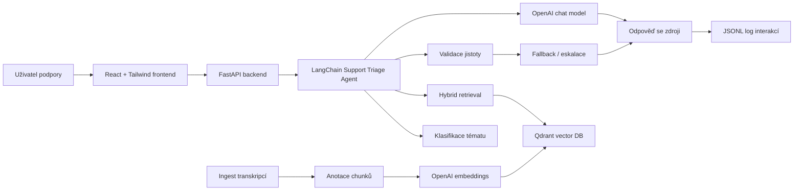
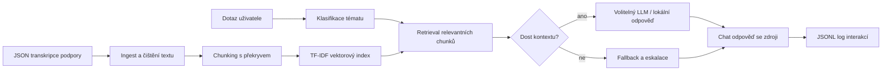

# Architektura řešení

Finální verze je dockerizovaná aplikace se separátním backendem, frontendem a vektorovou databází.

## Docker služby

- `frontend` - React aplikace servírovaná přes Nginx na `http://localhost:8080`
- `backend` - FastAPI + LangChain na `http://localhost:8000`
- `qdrant` - vektorová databáze na `http://localhost:6333`

## Produkční RAG tok

1. `POST /api/ingest` načte JSON transkripce.
2. Text se vyčistí, rozdělí na chunky a doplní metadaty.
3. Každý chunk dostane anotace: téma, záměr, možné řešení, krátké shrnutí a skóre kvality.
4. OpenAI embedding model vytvoří dense vektory.
5. Qdrant uloží dense + sparse reprezentaci pro hybridní retrieval.
6. Chat dotaz projde agentním workflow:
   - rozpoznání tématu,
   - retrieval v Qdrantu,
   - kontrola jistoty,
   - odpověď přes LLM nebo bezpečný fallback,
   - logování interakce.

## Proč Qdrant

Qdrant je vhodný pro hackathon demo, protože běží snadno v Dockeru, je rychlý, má payload metadata a podporuje hybridní vyhledávání. Díky tomu lze kombinovat sémantické embeddingy s přesnými výrazy jako `ePoukaz`, `VZP`, `SÚKL`, chybové kódy nebo názvy tlačítek.

## Agentní vrstva

Agent je řízený workflow, ne volně bloudící chatbot. Používá jasné kroky:

- `classify_issue` - určí téma,
- `retrieve_transcripts` - najde relevantní části hovorů,
- `validate_grounding` - zkontroluje jistotu,
- `draft_answer` - vytvoří krátkou odpověď,
- `create_escalation_packet` - připraví předání na 2. úroveň podpory,
- `log_interaction` - uloží dotaz, odpověď a zdroje.

Frontend tyto kroky ukazuje jako realtime „agent timeline“, aby porota viděla, proč asistent odpověděl právě takto.

## Původní jednoduchý fallback

Kořenové skripty `build_index.py`, `chat.py` a `evaluate.py` zůstávají jako offline záloha bez Dockeru a bez externích služeb.

## Datový tok offline fallbacku

1. `build_index.py` načte anonymizované JSON soubory z dodané složky.
2. Ingest ignoruje `_control-group`, extrahuje `TranscriptText`, opraví zalomení slov z transkripcí a odstraní redakční značky.
3. Text se rozdělí na překrývající se chunky, aby šlo dohledat konkrétní část hovoru.
4. `TfidfIndex` vytvoří sparse vektorový index bez externích závislostí.
5. `chat.py` rozpozná téma dotazu, vyhledá relevantní chunky a vygeneruje stručnou odpověď.
6. Pokud je nastaven `OPENAI_API_KEY`, odpověď sestaví OpenAI-kompatibilní LLM pouze nad nalezeným kontextem. Bez klíče se použije bezpečný lokální fallback.
7. Každý dotaz a odpověď se uloží do `logs/interactions.jsonl` pro pozdější vyhodnocení.

## Klíčová rozhodnutí

- Prototyp nevyžaduje frontend, protože zadání říká, že vývoj chat FE není cílem.
- Retrieval je implementovaný lokálně přes TF-IDF vektory, aby demo fungovalo i bez instalace databází typu Chroma/FAISS.
- LLM vrstva je volitelná a OpenAI-kompatibilní přes environment proměnné, takže se dá připojit soutěžní API klíč i jiný kompatibilní endpoint.
- Odpovědi mají fallback: pokud top výsledek nemá dostatečné skóre, asistent neimprovizuje a doporučí eskalaci.
