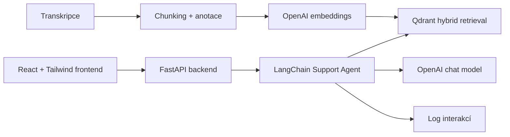

# XDENT AI Support Assistant

AI asistent pro zákaznický chat stomatologického softwaru XDENT. Řešení funguje jako 1. úroveň podpory: přijme dotaz, rozpozná téma, vyhledá relevantní části anonymizovaných transkripcí, odpoví stručně a při nejistotě připraví eskalaci.

## Co projekt obsahuje

- React + Tailwind frontend pro přehledné demo.
- FastAPI backend s LangChain agentním workflow.
- OpenAI chat model pro odpovědi.
- OpenAI embedding model pro vektory.
- Qdrant vektorovou databázi pro rychlý RAG.
- Hybridní retrieval: dense embeddings + sparse/BM25 styl vyhledávání.
- Anotace chunků: téma, záměr, možné řešení, shrnutí, kvalita zdroje.
- Zdroje odpovědi přímo z transkripcí.
- Strict mode a bezpečný fallback.
- JSONL log interakcí pro vyhodnocení kvality.
- Offline fallback skripty bez Dockeru a bez API klíče.

## Nejrychlejší spuštění v Dockeru

1. Zkopírujte env soubor:

```powershell
Copy-Item .env.example .env
```

2. Do `.env` doplňte:

```env
OPENAI_API_KEY=váš_api_klíč
```

3. Pokud máte transkripce jinde, upravte v `.env`:

```env
LOCAL_DATA_DIR=C:/cesta/k/hackathon-filtered-expanded
```

4. Spusťte aplikaci:

```powershell
docker compose up --build
```

5. Otevřete:

```text
http://localhost:8080
```

6. V aplikaci klikněte na `Indexovat data`. Tím se vytvoří Qdrant index z transkripcí.

## Užitečné příkazy

Spuštění produkčního dema:

```powershell
.\scripts\up.ps1
```

Vývojový režim s Vite frontendem:

```powershell
.\scripts\dev.ps1
```

Indexace dat přes backend kontejner:

```powershell
.\scripts\ingest.ps1
```

API dokumentace:

```text
http://localhost:8000/docs
```

Qdrant dashboard/API:

```text
http://localhost:6333/dashboard
```

## Demo scénář pro porotu

1. Otevřete `http://localhost:8080`.
2. Zkontrolujte stav `OpenAI ready` a počet chunků.
3. Vyberte ukázkový dotaz na ePoukaz.
4. Ukažte, že agent projde kroky:
   - rozpoznání tématu,
   - vyhledání v transkripcích,
   - kontrola jistoty,
   - sestavení odpovědi.
5. Ukažte evidence cards se zdroji z transkripcí.
6. Zapněte `Strict mode` a ukažte bezpečnější chování.
7. Položte dotaz mimo znalostní bázi a ukažte eskalační balíček pro 2. úroveň podpory.

## Architektura



Detailní popis je v [ARCHITEKTURA.md](ARCHITEKTURA.md).

## API endpointy

- `GET /health` - kontrola backendu
- `GET /api/stats` - statistiky indexu a témat
- `POST /api/ingest` - načtení a indexace transkripcí
- `POST /api/chat` - chat odpověď
- `POST /api/chat/stream` - stream pro realtime frontend
- `POST /api/evaluate` - evaluace testovacích dotazů

## Offline fallback

Původní jednoduchý prototyp zůstává dostupný i bez Dockeru:

```powershell
python build_index.py --data-dir "C:\Users\medun\Desktop\hacktaton\hackathon-filtered-expanded"
python chat.py --no-llm --question "Nejde mi odeslat ePoukaz, systém píše chybu s úhradou."
python evaluate.py --questions eval_questions.json --no-llm
```

Tento režim používá lokální TF-IDF index a je vhodný jako záloha, pokud není dostupný Docker nebo API klíč.

## Výstupy vůči zadání

- Návrh architektury: [ARCHITEKTURA.md](ARCHITEKTURA.md)
- Funkční prototyp: Docker Compose aplikace
- Technický popis: tento README + backend/frontend README
- Popis práce s transkripcemi: ingest, anotace, embeddingy, Qdrant
- Návod ke spuštění: sekce výše
- Zdrojový kód: tento repozitář
- Demo: frontend konzole
- Evaluace: `/api/evaluate` a `eval_questions.json`
